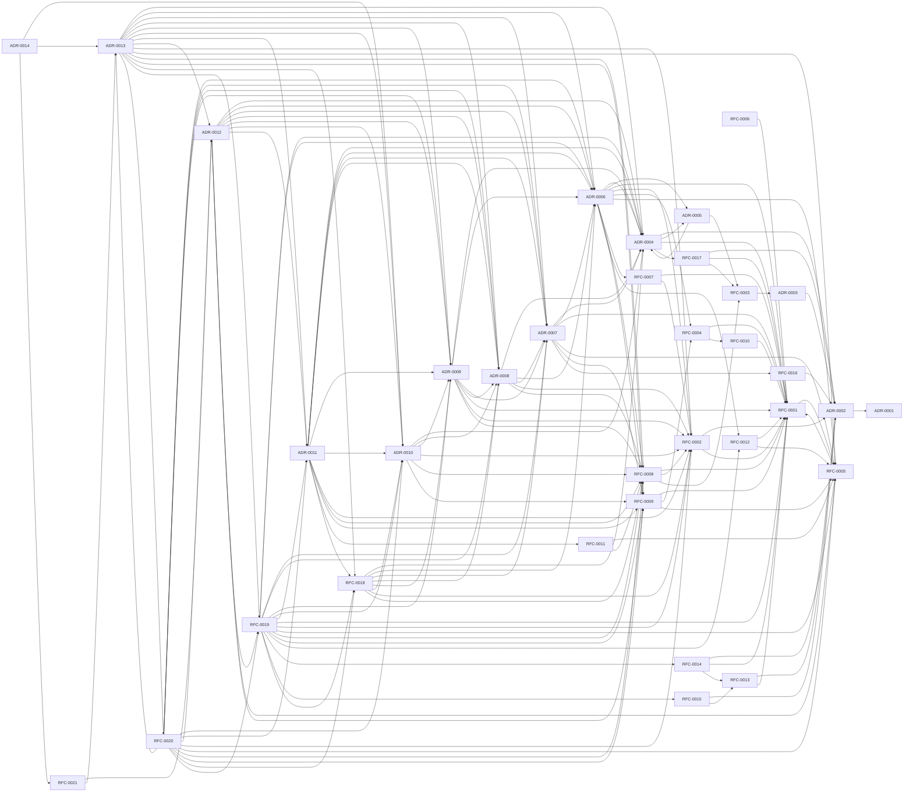

# Document Graph (derived)

- Class: DERIVED, NON-AUTHORITATIVE -- informative documentation only
  (Baseline L-2). It defines nothing; on any conflict the repository
  source documents win and this file is regenerated.
- Ownership: P13 documentation pipeline
  (`docs/program/DOC_DERIVATION_CONVENTIONS.md`); never hand-edited.
- Generated by: `tools/docs/derive_document_graph.py`.
- Regenerate from the repository root: `python tools/docs/derive_document_graph.py`
  (or `python tools/docs/build_docs.py` to rebuild all derived docs).
- Output: `docs/derived/DOCUMENT_GRAPH.md`.
- Sources:
  - `docs/constitution/*.md`
  - `docs/architecture/*.md`
  - `docs/decisions/ADR-*.md`
  - `docs/rfc/RFC-*.md`
- Limitations: mechanical extraction only -- no summaries, no
  interpretation, no status or disposition synthesis, no behavior
  claims.
- An edge is a Markdown link or a lexical token occurrence, never a semantic, status, or authority relationship.
- External, fragment-only, and placeholder link targets are not graphed.

## Edges by document

| Document | Relative links to | Governance records referenced |
| --- | --- | --- |
| `docs/architecture/README.md` | `docs/architecture/baseline.md`; `docs/architecture/blueprint.md`; `docs/architecture/doctrine.md` | (none) |
| `docs/architecture/baseline.md` | (none) | `docs/decisions/ADR-0002.md`; `docs/decisions/ADR-0006.md`; `docs/rfc/RFC-0007.md` |
| `docs/architecture/blueprint.md` | (none) | `docs/decisions/ADR-0002.md`; `docs/rfc/RFC-0001.md` |
| `docs/architecture/doctrine.md` | (none) | `docs/decisions/ADR-0001.md`; `docs/decisions/ADR-0002.md` |
| `docs/constitution/01-mission.md` | (none) | (none) |
| `docs/constitution/02-vision.md` | (none) | (none) |
| `docs/constitution/03-core-values.md` | (none) | (none) |
| `docs/constitution/04-engineering-principles.md` | (none) | (none) |
| `docs/constitution/05-architecture-principles.md` | (none) | (none) |
| `docs/constitution/06-governance.md` | (none) | (none) |
| `docs/constitution/07-decision-making.md` | (none) | (none) |
| `docs/constitution/08-compatibility-policy.md` | (none) | (none) |
| `docs/constitution/09-release-policy.md` | (none) | (none) |
| `docs/constitution/10-long-term-goals.md` | (none) | (none) |
| `docs/constitution/README.md` | `docs/constitution/01-mission.md`; `docs/constitution/02-vision.md`; `docs/constitution/03-core-values.md`; `docs/constitution/04-engineering-principles.md`; `docs/constitution/05-architecture-principles.md`; `docs/constitution/06-governance.md`; `docs/constitution/07-decision-making.md`; `docs/constitution/08-compatibility-policy.md`; `docs/constitution/09-release-policy.md`; `docs/constitution/10-long-term-goals.md` | (none) |
| `docs/decisions/ADR-0001.md` | (none) | (none) |
| `docs/decisions/ADR-0002.md` | (none) | `docs/decisions/ADR-0001.md` |
| `docs/decisions/ADR-0003.md` | (none) | `docs/decisions/ADR-0002.md` |
| `docs/decisions/ADR-0004.md` | (none) | `docs/decisions/ADR-0002.md`; `docs/decisions/ADR-0005.md`; `docs/rfc/RFC-0001.md`; `docs/rfc/RFC-0017.md` |
| `docs/decisions/ADR-0005.md` | (none) | `docs/decisions/ADR-0004.md`; `docs/rfc/RFC-0003.md` |
| `docs/decisions/ADR-0006.md` | (none) | `docs/decisions/ADR-0004.md`; `docs/decisions/ADR-0005.md`; `docs/rfc/RFC-0001.md`; `docs/rfc/RFC-0002.md`; `docs/rfc/RFC-0004.md`; `docs/rfc/RFC-0005.md`; `docs/rfc/RFC-0007.md`; `docs/rfc/RFC-0008.md`; `docs/rfc/RFC-0009.md`; `docs/rfc/RFC-0012.md` |
| `docs/decisions/ADR-0007.md` | (none) | `docs/decisions/ADR-0004.md`; `docs/decisions/ADR-0006.md`; `docs/rfc/RFC-0001.md`; `docs/rfc/RFC-0005.md`; `docs/rfc/RFC-0009.md`; `docs/rfc/RFC-0016.md` |
| `docs/decisions/ADR-0008.md` | (none) | `docs/decisions/ADR-0004.md`; `docs/decisions/ADR-0006.md`; `docs/decisions/ADR-0007.md`; `docs/rfc/RFC-0002.md`; `docs/rfc/RFC-0008.md` |
| `docs/decisions/ADR-0009.md` | (none) | `docs/decisions/ADR-0004.md`; `docs/decisions/ADR-0006.md`; `docs/decisions/ADR-0007.md`; `docs/decisions/ADR-0008.md`; `docs/rfc/RFC-0001.md`; `docs/rfc/RFC-0002.md`; `docs/rfc/RFC-0008.md` |
| `docs/decisions/ADR-0010.md` | (none) | `docs/decisions/ADR-0004.md`; `docs/decisions/ADR-0008.md`; `docs/decisions/ADR-0009.md`; `docs/rfc/RFC-0002.md`; `docs/rfc/RFC-0008.md`; `docs/rfc/RFC-0009.md` |
| `docs/decisions/ADR-0011.md` | (none) | `docs/decisions/ADR-0004.md`; `docs/decisions/ADR-0006.md`; `docs/decisions/ADR-0007.md`; `docs/decisions/ADR-0008.md`; `docs/decisions/ADR-0009.md`; `docs/decisions/ADR-0010.md`; `docs/rfc/RFC-0002.md`; `docs/rfc/RFC-0008.md`; `docs/rfc/RFC-0009.md`; `docs/rfc/RFC-0011.md`; `docs/rfc/RFC-0018.md` |
| `docs/decisions/ADR-0012.md` | (none) | `docs/decisions/ADR-0004.md`; `docs/decisions/ADR-0006.md`; `docs/decisions/ADR-0007.md`; `docs/decisions/ADR-0008.md`; `docs/decisions/ADR-0009.md`; `docs/decisions/ADR-0010.md`; `docs/decisions/ADR-0011.md`; `docs/rfc/RFC-0005.md`; `docs/rfc/RFC-0009.md`; `docs/rfc/RFC-0019.md` |
| `docs/decisions/ADR-0013.md` | (none) | `docs/decisions/ADR-0004.md`; `docs/decisions/ADR-0006.md`; `docs/decisions/ADR-0007.md`; `docs/decisions/ADR-0008.md`; `docs/decisions/ADR-0009.md`; `docs/decisions/ADR-0010.md`; `docs/decisions/ADR-0011.md`; `docs/decisions/ADR-0012.md`; `docs/rfc/RFC-0002.md`; `docs/rfc/RFC-0005.md`; `docs/rfc/RFC-0008.md`; `docs/rfc/RFC-0009.md`; `docs/rfc/RFC-0018.md`; `docs/rfc/RFC-0019.md`; `docs/rfc/RFC-0020.md` |
| `docs/decisions/ADR-0014.md` | (none) | `docs/decisions/ADR-0010.md`; `docs/decisions/ADR-0013.md`; `docs/rfc/RFC-0021.md` |
| `docs/rfc/RFC-0001.md` | (none) | `docs/rfc/RFC-0005.md` |
| `docs/rfc/RFC-0002.md` | (none) | `docs/decisions/ADR-0002.md`; `docs/rfc/RFC-0001.md` |
| `docs/rfc/RFC-0003.md` | (none) | `docs/decisions/ADR-0003.md` |
| `docs/rfc/RFC-0004.md` | (none) | `docs/rfc/RFC-0001.md`; `docs/rfc/RFC-0010.md` |
| `docs/rfc/RFC-0005.md` | (none) | `docs/rfc/RFC-0001.md` |
| `docs/rfc/RFC-0006.md` | (none) | `docs/rfc/RFC-0001.md` |
| `docs/rfc/RFC-0007.md` | (none) | `docs/rfc/RFC-0001.md`; `docs/rfc/RFC-0002.md` |
| `docs/rfc/RFC-0008.md` | (none) | `docs/rfc/RFC-0001.md`; `docs/rfc/RFC-0002.md`; `docs/rfc/RFC-0003.md` |
| `docs/rfc/RFC-0009.md` | (none) | `docs/rfc/RFC-0001.md`; `docs/rfc/RFC-0004.md`; `docs/rfc/RFC-0005.md` |
| `docs/rfc/RFC-0010.md` | (none) | `docs/rfc/RFC-0001.md` |
| `docs/rfc/RFC-0011.md` | (none) | `docs/rfc/RFC-0005.md`; `docs/rfc/RFC-0008.md` |
| `docs/rfc/RFC-0012.md` | (none) | `docs/rfc/RFC-0001.md`; `docs/rfc/RFC-0005.md` |
| `docs/rfc/RFC-0013.md` | (none) | `docs/decisions/ADR-0002.md`; `docs/rfc/RFC-0001.md` |
| `docs/rfc/RFC-0014.md` | (none) | `docs/decisions/ADR-0002.md`; `docs/rfc/RFC-0001.md`; `docs/rfc/RFC-0013.md` |
| `docs/rfc/RFC-0015.md` | (none) | `docs/decisions/ADR-0002.md`; `docs/rfc/RFC-0013.md` |
| `docs/rfc/RFC-0016.md` | (none) | `docs/decisions/ADR-0002.md` |
| `docs/rfc/RFC-0017.md` | (none) | `docs/decisions/ADR-0002.md`; `docs/rfc/RFC-0001.md`; `docs/rfc/RFC-0003.md` |
| `docs/rfc/RFC-0018.md` | (none) | `docs/decisions/ADR-0004.md`; `docs/decisions/ADR-0006.md`; `docs/decisions/ADR-0007.md`; `docs/decisions/ADR-0008.md`; `docs/decisions/ADR-0009.md`; `docs/decisions/ADR-0010.md`; `docs/rfc/RFC-0002.md`; `docs/rfc/RFC-0008.md` |
| `docs/rfc/RFC-0019.md` | (none) | `docs/decisions/ADR-0004.md`; `docs/decisions/ADR-0006.md`; `docs/decisions/ADR-0007.md`; `docs/decisions/ADR-0008.md`; `docs/decisions/ADR-0009.md`; `docs/decisions/ADR-0010.md`; `docs/decisions/ADR-0011.md`; `docs/rfc/RFC-0001.md`; `docs/rfc/RFC-0002.md`; `docs/rfc/RFC-0005.md`; `docs/rfc/RFC-0008.md`; `docs/rfc/RFC-0009.md`; `docs/rfc/RFC-0012.md`; `docs/rfc/RFC-0014.md`; `docs/rfc/RFC-0015.md`; `docs/rfc/RFC-0018.md` |
| `docs/rfc/RFC-0020.md` | (none) | `docs/decisions/ADR-0006.md`; `docs/decisions/ADR-0007.md`; `docs/decisions/ADR-0008.md`; `docs/decisions/ADR-0009.md`; `docs/decisions/ADR-0010.md`; `docs/decisions/ADR-0011.md`; `docs/decisions/ADR-0012.md`; `docs/decisions/ADR-0013.md`; `docs/rfc/RFC-0002.md`; `docs/rfc/RFC-0005.md`; `docs/rfc/RFC-0008.md`; `docs/rfc/RFC-0009.md`; `docs/rfc/RFC-0018.md`; `docs/rfc/RFC-0019.md` |
| `docs/rfc/RFC-0021.md` | (none) | `docs/decisions/ADR-0012.md`; `docs/decisions/ADR-0013.md` |

## Governance reference graph (ADR / RFC files)

Edges read "source mentions target" -- lexical token occurrence only.

